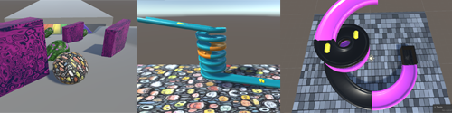
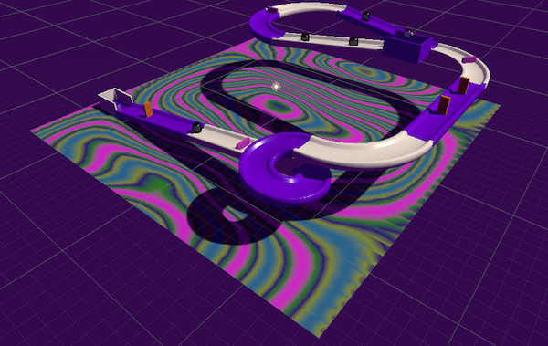
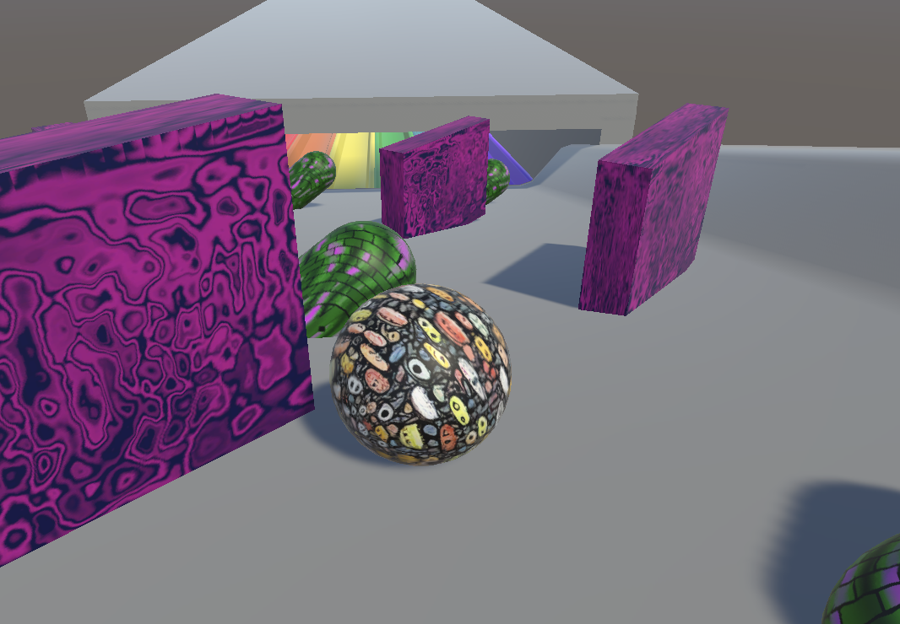
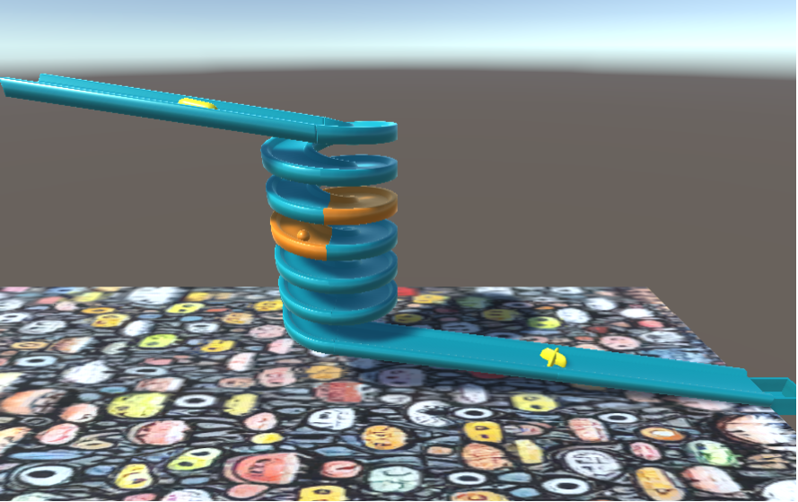
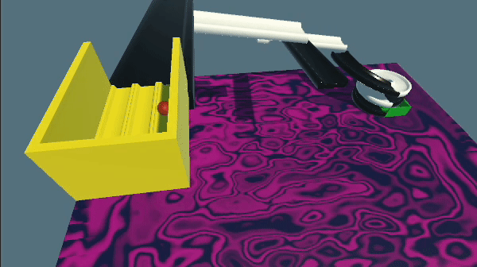

## You will make

In this project, you will design your own track to roll a ball down using **tilt**. You will also add in your own interactive objects to the track. You will choose whether the camera follows the ball or stays in the same place. 

You will:

+ Design a track by arranging GameObjects in the Scene view and adding spinning obstacles
+ Choose Materials for the ball, the track and all the obstacles
+ Decide whether the camera will follow the ball or stay still
+ Configure physics materials to control how objects interact

### You will need

This project requires the Unity Editor, which can be installed from the Unity Hub. This is a large download and install, so we recommend you install it before starting this project.

You can follow our [Unity guide](https://projects.raspberrypi.org/en/projects/unity-guide){:target="_blank"} to install the Unity Hub and the Unity Editor for your operating system.

--- no-print ---

### Play 🎡

Tilt the world using the <kbd>WASD</kbd> keys to roll the marble down the track.

<iframe allowtransparency="true" width="710" height="500" src="https://raspberrypilearning.github.io/unity-webgl/TrackDesigner" scrolling = "no" frameborder="0" alt="A demo of an example completed project of a 3D theme-park style race track with obstacles. Players can use the keyboard to control tilting the camera, and rolling a ball across the track"></iframe>

--- /no-print ---

--- print-only ---

--- /print-only ---

### Get ideas 💭

You are going to make some design decisions to build your own track.

Explore these example projects to get more ideas:

[Try a track with a colour switching ball](https://raspberrypilearning.github.io/unity-webgl/track){:target='_blank'}
{:width="400px"}

[Try a twisty track with rotating obstacles.](https://raspberrypilearning.github.io/unity-webgl/TwistyTrack){:target='_blank'}
{:width="400px"}

[Try a track with ramps that move](https://raspberrypilearning.github.io/unity-webgl/TrackDesignerMoving/){:target='_blank'}
{:width="400px"}
