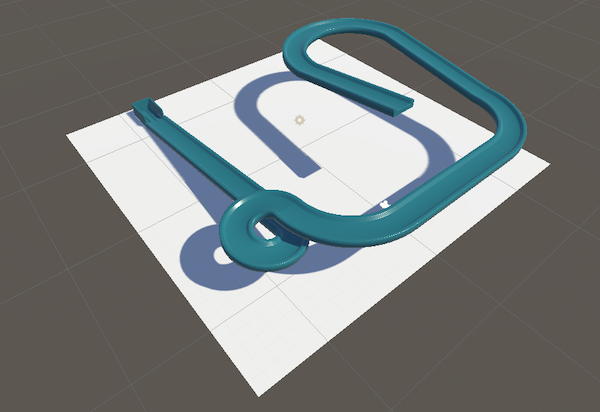

## Design the track

In this step, you will design your track using the parts available in the parts folder.  

### Create a project with the starter package

--- task ---

Launch the Unity Hub and click **Projects** then select **New project**:

From the list choose **All templates** then select **3D Core**:

Edit the project settings to give your project a name such as 'Pixel art reveal' and save it to a sensible location. Then click **Create project**.

Your new project will open in the Unity Editor. It may take some time to load.

--- /task ---

--- task ---

The Unity starter package you downloaded for this More Unity path contains a number of **Assets** for you to use in your project.

To import them into your new project, click on the **Assets menu** and select **Import package > Custom Package…** then navigate to the downloaded Unity starter package.

--- collapse ---
---
title: I haven't downloaded a Unity starter package
---

Download and unzip the [More Unity starter package](https://rpf.io/p/en/rainbow-run-go){:target="_blank"} to your computer. 

**Tip:** Choose a sensible location such as your Documents folder. 

--- /collapse ---

[[[unity-importing-a-package]]]

--- /task ---

--- task ---

Right-click on **SampleScene** in the Hierarchy and choose **Save Scene As**: 

In the pop-up window, name your Scene `Track-Designer` or choose your own name:

A new file will appear in the Assets folder in the Project window.

--- /task ---

### Add a floor

--- task ---

Right-click on your scene in the Hierarchy window and choose **GameObject > 3D Object > Plane**.

This will create a ground for your track to sit on.

--- /task ---

--- task ---

**Choose** a size for your plane by changing the 'X' and 'Z' scale values.

Our example changes the 'Z' value to `2`:

--- /task ---

--- task ---

In the Project window, click on **Materials > Obstacle Materials**.

**Choose** a material for your plane and drag it onto the 'Scene' view. 

Our example uses the 'Concrete' material:

--- /task ---

### Design your track structure

--- task ---

**Choose** where to place the goal for your track. 

In the 'Project' window, go to 'Assets -> Parts'.

Drag in the goal part to your scene. 

--- /task ---

--- task ---

**Change** the 'Transform Position' values to X=`0`, Y=`0`, Z=`0` to start your part in the middle of your scene. 

Move your goal part until you are satisfied with where it is positioned. 

ADD IN A MOVING GAMEOBJECT INGREDIENT!!!

--- /task ---

--- task ---

It is practical to create your track from the **last** part to the **first**. 

**Choose** the final part of your track that will link to your goal part. 

Drag in your part and position it next to your goal. 

[[[unity-scene-navigation]]]

[[[unity-vertex-snapping]]]

**Tip**: Look at your parts from lots of different angles to make sure that they are lined up correctly.

**Tip**: It is OK to move your goal to a new position if you have decided it doesn't work where it is currently located.

--- /task ---

--- task ---

Add in the remaining parts for your track. Continue to add parts from the bottom to the top.

**Tip**: Make sure that the ball can roll down towards the goal.

--- /task ---

### Add materials to your track

--- task ---

**Choose:** a material for each piece in your track. 

In the Project window, go to **Materials > ObstacleMaterials**. Drag a coloured material onto each piece in the Scene view.   

--- /task ----

