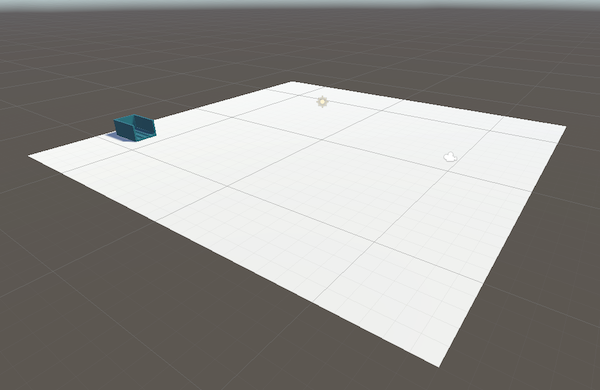
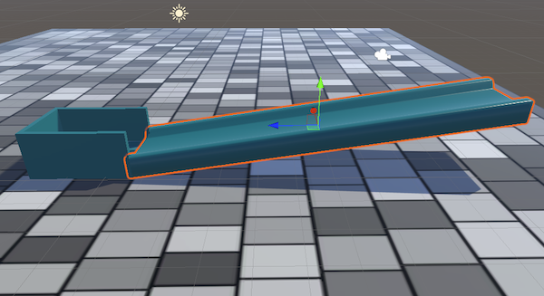

## Design the track

In this step, you will design your track using the parts available in the parts folder.  

### Create a project with the starter package

--- task ---

Launch the Unity Hub and click **Projects** then select **New project**:

From the list choose **All templates** then select **3D Core**:

Edit the project settings to give your project a name such as 'Pixel art reveal' and save it to a sensible location. Then click **Create project**.

Your new project will open in the Unity Editor. It may take some time to load.

--- /task ---

--- task ---

The Unity starter package you downloaded for this More Unity path contains a number of **Assets** for you to use in your project.

To import them into your new project, click on the **Assets menu** and select **Import package > Custom Package…** then navigate to the downloaded Unity starter package.

--- collapse ---
---
title: I haven't downloaded a Unity starter package
---

Download and unzip the [More Unity starter package](https://rpf.io/p/en/rainbow-run-go){:target="_blank"} to your computer. 

**Tip:** Choose a sensible location such as your Documents folder. 

--- /collapse ---

[[[unity-importing-a-package]]]

--- /task ---

--- task ---

Right-click on **SampleScene** in the Hierarchy and choose **Save Scene As**: 

In the pop-up window, name your Scene `Track-Designer` or choose your own name:

A new file will appear in the Assets folder in the Project window.

--- /task ---

### Add a floor

--- task ---

Right-click on your scene in the Hierarchy window and choose **GameObject > 3D Object > Plane**.

This will create a ground for your track to sit on.

[[[unity-plane]]]

--- /task ---

--- task ---

**Choose** a size for your plane by changing the 'X' and 'Z' scale values.

Our example changes the 'Z' value to `2`:

--- /task ---

### Design your track structure

Your track needs:
+ A start
+ Middle pieces
+ A goal 

It is practical to create your track from the **last** part (the goal) to the **first** part (the start). 

**Tip**: Make sure that you design your track so that the ball can roll down towards the goal.

--- task ---

**Choose** your goal and drag the part into your scene. You could:
+ Use the plane as the goal
+ Use the existing 'goal' part from the 'Assets -> Parts' folder
+ Create your own goal from 3D objects

[[[unity-model-gameobject]]]
[[[unity-3d-objects]]]

--- /task ---

--- task ---

Set the transform position, rotation and scale of your goal until you are satisfied with where it is positioned.  

**Tip:** The 'Transform Position' values X=`0`, Y=`0`, Z=`0` start your goal in the middle of your scene. 

[[[unity-scene-navigation]]]
[[[unity-scene-top-down]]]
[[[unity-3D-coordinates]]]
[[[unity-transform-tools]]]

--- /task ---

--- task ---

**Choose** your parts one at a time starting with the part that links to your goal. 

Each time change the transform position, rotation, and scale if needed and make sure the track position lines up with the previous part. 

**Tip**: Look at your parts from lots of different angles to make sure that they are lined up correctly.

**Tip**: It is OK to change the position of previous parts as you design and build your track.

[[[unity-scene-navigation]]]

[[[unity-vertex-snapping]]]

ADD IN A SCENE GIZMO INGREDIENT!!!

--- /task ---

### Add materials to your scene

--- task ---

**Choose:** a material for each piece in your track. 

In the Project window, go to **Materials > ObstacleMaterials**. Drag a coloured material onto each piece in the Scene view.   

[[[unity-existing-material]]]
[[[unity-material-with-texture]]]
[[[unity-glass-material]]]

--- /task ---

--- task ---

Create a sky box for your scene.

[[[unity-skybox]]]

--- /task ---

