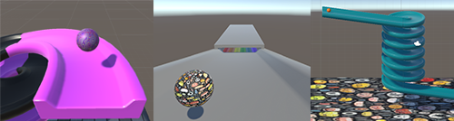

## Add a ball

In this step you will add a ball and place it at the top of your track so that it rolls down. 

### Add a sphere

--- task ---

Add a Sphere GameObject and rename it to `Ball`. 

Scale the ball to fit your project (we used  X=`0.25`, Y=`0.25`, Z=`0.25`).

Add a material for your ball.

[[[unity-transform-tools]]]
[[[unity-existing-material]]]
[[[unity-material-with-texture]]]
[[[unity-glass-material]]]

--- /task ---

--- task ---

Position the ball at the top of your track slightly higher than the track surface.

[[[unity-scene-navigation]]]
[[[unity-scene-top-down]]]
[[[unity-3D-coordinates]]]

**Tip**: The 'Top' view is a good view for making sure that your ball is in the right place.

--- /task ---

### React to gravity

--- task ---

Add a Rigidbody to your ball. 

[[[unity-rigidbody]]]

--- /task ---

--- task ---

Click on the **View tool** in the Scene view (the hand icon) and drag the view until you can see the ball and the track.

Align the camera to the Scene view.

[[[unity-align-with-view]]]

--- /task ---

--- task ---

**Test:** Play your scene and the ball should roll down your track. 

**Debug:** If your ball gets stuck then you may need to redesign your track.

--- /task ---

### Apply physics material

--- task ---

Create a bouncy material.

[[[bouncy-material]]]

--- /task ---

--- task ---

Click **Play** and watch your ball bounce as it lands on the ramp.

**Debug:** If your ball bounces too high and keeps bouncing off the track or if your ball moves too slowly you may need to adjust the values in your Physic Materials.

--- /task ---

### User interaction

--- task ---

**Choose** how you would like your camera to work.

You could keep the camera in a fixed position:

[[[unity-align-with-view]]]

Or, drag the Scene view so that you are behind the ball then follow the ball down the track: 

[[[unity-scene-navigation]]]
[[[unity-camera-follow-ball]]]

--- /task ---

--- task ---

**Test** your camera by running your project. 

--- /task ---

--- task ---

**Choose** if you would like to control your ball.

--- collapse ---
---
title: Control your ball with the keyboard keys
---

Go to the Inspector window for the 'Ball' and click on the **Add Component** button. 

Create a new script called `BallController`.

Open the script and enter the code below:

--- code ---
---
language: cs
filename: BallController.cs
line_numbers: true
line_number_start: 1
line_highlights: 
---

using System.Collections;
using System.Collections.Generic;
using UnityEngine;

public class BallController : MonoBehaviour
{
   private Rigidbody rb;
   public Transform cameraTransform;

   // Start is called before the first frame update
   void Start()
   {
       rb = this.GetComponent<Rigidbody>();
       rb.transform.forward = cameraTransform.forward;

   }

   // FixedUpdate is called once per fixed frame-rate frame
   void FixedUpdate()
   {  
       // Calculates cameraTransform.forward without the y value so the ball doesn't move up and down on the Y axis
       Vector3 forward = new Vector3(cameraTransform.forward.x, 0, cameraTransform.forward.z).normalized;
       Vector3 right =  Quaternion.AngleAxis(90, Vector3.up) * forward;
       Vector3 left = -right;
       Vector3 backward = -forward;

       if (Input.GetKey("d"))
       {
           rb.AddForce(right * 5f);
       }

       if (Input.GetKey("a"))
       {
           rb.AddForce(left * 5f);
       }

       if (Input.GetKey("w"))
       {
          rb.AddForce(forward * 10f);
       }

       if (Input.GetKey("s"))
       {
          rb.AddForce(backward * 2f);
       }

       if (Input.GetKeyDown("space"))
       {
          rb.AddForce(0f, 75f, 0f);
       }
   } 
}

--- /code ---

**Save** your code and return to Unity.

With the 'Ball' GameObject selected in the 'Hierarchy' window. Drag the 'Main Camera' GameObject onto the `Camera Transform` variable in the 'Inspector' window inside the script.

--- /collapse ---

--- collapse ---
---
title: I want to use different keys
---

If you want to know the naming conventions to use for the other keys on your keyboard then you can visit the [Unity Documentation](https://docs.unity3d.com/Manual/class-InputManager.html){:target="_blank"}.

--- /collapse ---

--- /task ---

--- task ---

**Test** your ball controls by running your project. 

--- /task ---

