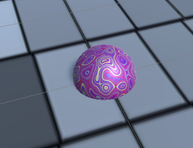
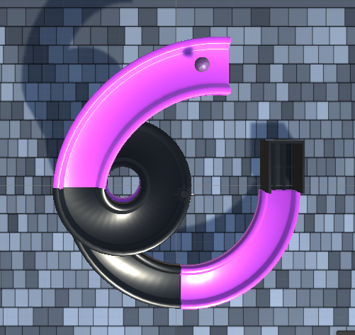
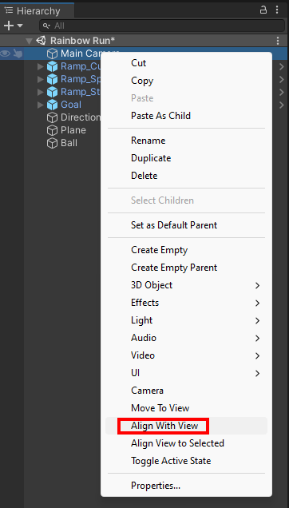
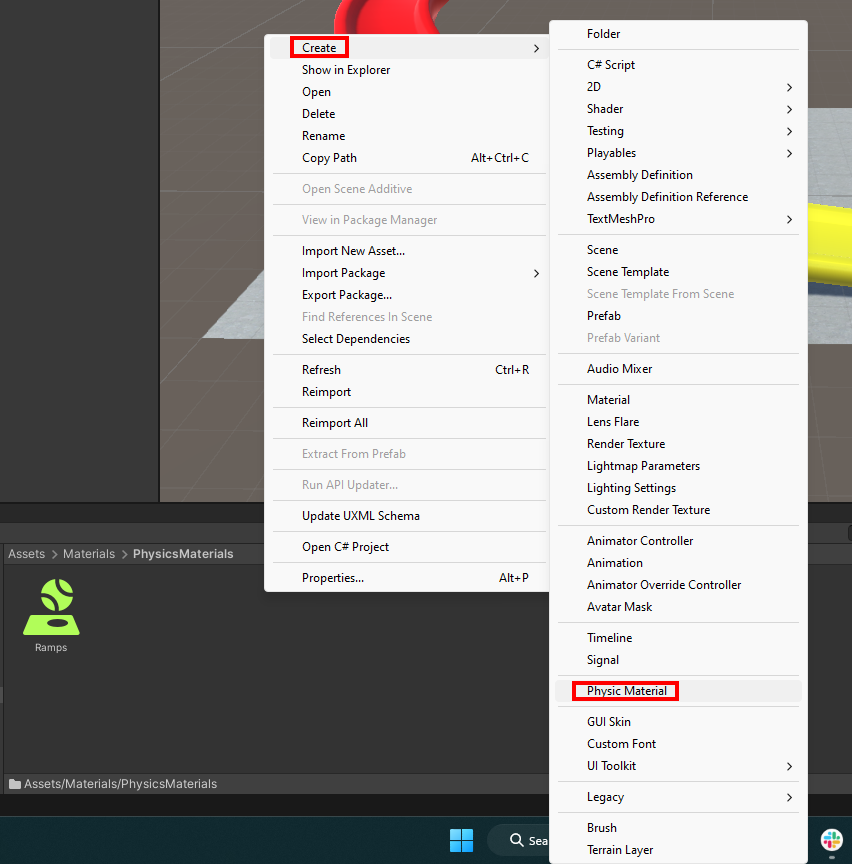
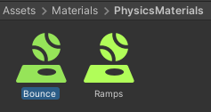
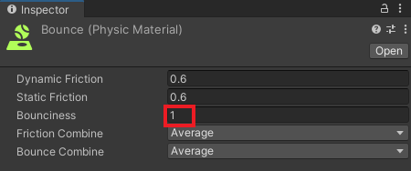
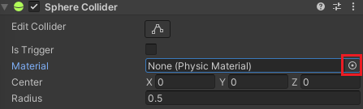
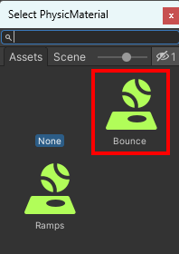
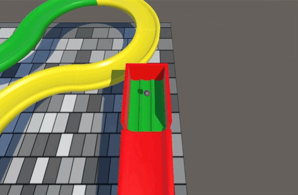

## Add a ball

In this step you will add a ball and place it at the top of your track so that it rolls down. 

### Add a sphere

--- task ---

Add a Sphere GameObject and rename it to `Ball`.

**Tip**: You may want to reset the 'Transform position' to place it in the centre of your scene.  

--- /task ---

--- task ---

**Choose** a scale for your ball. 

**Tip:** We used X=`0.25`, Y=`0.25`, Z=`0.25` in the Rainbow Run project which is a good size for the parts that you have if you haven't changed their scale. 

--- /task ---

--- task ---

**Choose** a material for your ball.

--- /task ---

--- task ---

Position the ball at the top of your track.

**Tip**: The 'Top' view is a good view for making sure that your ball is in the right place.

--- /task ---

### React to gravity

--- task ---

With the 'Ball' GameObject selected, choose 'Add Component' in the inspector window and enter the text 'RigidBody'. Select the 'RigidBody' component. This adds a gravity effect to your ball. 

--- /task ---

--- task ---

Right-click on the 'MainCamera' object in the 'Hierarchy'.

Choose 'Align with view'. This will match your Scene view and your Main Camera view. 

--- /task ---

--- task ---

**Test:** Play your scene and the ball should roll down your track. 

**Debug:** If your ball gets stuck then you may need to redesign your track.

--- /task ---

### Apply physics material

--- task ---

In the Project window select 'Materials' and then 'PhysicsMaterials'. Right-click in the window, click 'Create' and select **Physic Material**. 

--- /task ---

--- task ---

Name the material 'Bounce'.

--- /task ---

--- task ---

Change Bounciness to `1`.

--- /task ---

--- task ---

Select the 'Ball' GameObject and go to the Inspector window.

Find the 'Sphere Collider' properties and click on the small circle in the 'Material' section. 

Double-click on your new 'Bounce' physics material.

--- /task ---

--- task ---

Click **Play** and watch your ball bounce as it lands on the ramp.

--- /task ---

### User interaction

--- task ---

**Choose** how you would like your camera to work.

--- collapse ---
---
title: Keep the camera in a fixed position
---

Click on the **View tool** in the Scene view (the hand icon) and drag the view until you are happy with the view of your track. Right-click on the Main Camera object in the Hierarchy window and select 'Align With View':

--- /collapse ---

--- collapse ---
---
title: Make the camera follow a ball
---

Position your camera so that it is behind the ball.

Go to the Hierarchy window. Right-click on the 'Main Camera' and select **Align With View**. 

Go to the Inspector window for the 'Main Camera' and click on the **Add Component** button. Create a new script called `CameraController`.

Open the `CameraController` script and enter the following code:

--- code ---
---
language: cs
filename: CameraController.cs
line_numbers: true
line_number_start: 1
line_highlights: 
---

using System.Collections;
using System.Collections.Generic;
using UnityEngine;

public class CameraController : MonoBehaviour
{
  public float sensitivity = 5f;
  public GameObject ball;
  private Vector3 prevBallPos;

  void Start()
   {
       // Calculate where the camera is in relation to the player (ball)
       transform.LookAt(ball.transform);
       prevBallPos = ball.transform.position;
   }

void LateUpdate()
   {
       float mouse = Input.GetAxis("Mouse Y");
       transform.Rotate(new Vector3(mouse * sensitivity * -1, 0, 0));
       float look = Input.GetAxis("Mouse X") * sensitivity;
       transform.RotateAround(ball.transform.position, Vector3.up, look);
       // Moves the camera by the same amount the ball has moved
       transform.Translate(ball.transform.position - prevBallPos, Space.World);
       prevBallPos = ball.transform.position;
   }
}

--- /code ---

**Save** and return to Unity.

With the 'Main Camera' selected, drag the `Ball` GameObject to the `Ball` variable in the Inspector window inside your `CameraController` script.

--- /collapse ---

[[[unity-scene-navigation]]]

--- /task ---

--- task ---

**Test** your camera by running your project. 

--- /task ---

--- task ---

**Choose** if you would like to control your ball.

--- collapse ---
---
title: Control your ball with the keyboard keys
---

Go to the Inspector window for the 'Ball' and click on the **Add Component** button. 

Create a new script called `BallController`.

Open the script and enter the code below:

--- code ---
---
language: cs
filename: BallController.cs
line_numbers: true
line_number_start: 1
line_highlights: 
---

using System.Collections;
using System.Collections.Generic;
using UnityEngine;

public class BallController : MonoBehaviour
{
   private Rigidbody rb;
   public Transform cameraTransform;

   // Start is called before the first frame update
   void Start()
   {
       rb = this.GetComponent<Rigidbody>();
       rb.transform.forward = cameraTransform.forward;

   }

   // FixedUpdate is called once per fixed frame-rate frame
   void FixedUpdate()
   {  
       // Calculates cameraTransform.forward without the y value so the ball doesn't move up and down on the Y axis
       Vector3 forward = new Vector3(cameraTransform.forward.x, 0, cameraTransform.forward.z).normalized;
       Vector3 right =  Quaternion.AngleAxis(90, Vector3.up) * forward;
       Vector3 left = -right;
       Vector3 backward = -forward;

       if (Input.GetKey("d"))
       {
           rb.AddForce(right * 5f);
       }

       if (Input.GetKey("a"))
       {
           rb.AddForce(left * 5f);
       }

       if (Input.GetKey("w"))
       {
          rb.AddForce(forward * 10f);
       }

       if (Input.GetKey("s"))
       {
          rb.AddForce(backward * 2f);
       }

       if (Input.GetKeyDown("space"))
       {
          rb.AddForce(0f, 75f, 0f);
       }
   } 
}

--- /code ---

**Save** your code and return to Unity.

With the 'Ball' GameObject selected in the 'Hierarchy' window. Drag the 'Main Camera' GameObject onto the `Camera Transform` variable in the 'Inspector' window inside the script.

--- /collapse ---

--- collapse ---
---
title: I want to use different keys
---

If you want to know the naming conventions to use for the other keys on your keyboard then you can visit the [Unity Documentation](https://docs.unity3d.com/Manual/class-InputManager.html){:target="_blank"}.

--- /collapse ---

--- /task ---

--- task ---

**Test** your ball controls by running your project. 

--- /task ---

