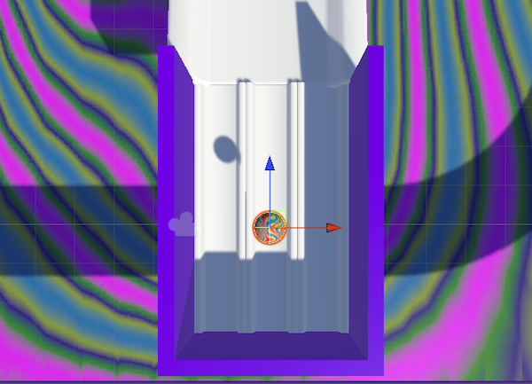
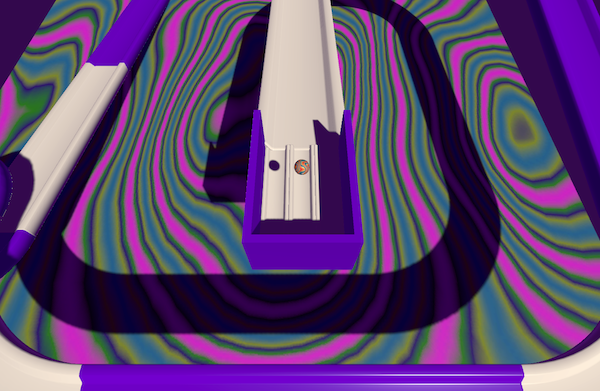
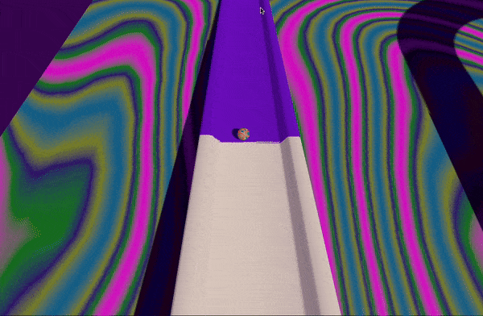
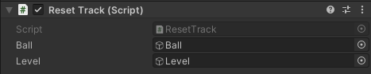

## Roll a ball

In this step, you will add a ball and place it at the top of your track. You will also make the world tilt so you can roll the ball down the track. 

### Add a sphere

--- task ---

Add a Sphere GameObject and rename it `Ball`. 

Scale the ball to fit your project (we used  X=`0.25`, Y=`0.25`, Z=`0.25`).

Add a material for your ball.

[[[unity-transform-tools]]]
[[[unity-existing-material]]]
[[[unity-material-with-texture]]]
[[[unity-glass-material]]]

--- /task ---

--- task ---

Position the ball at the top of your track slightly higher than the track surface.

[[[unity-scene-navigation]]]
[[[unity-scene-top-down]]]
[[[unity-3D-coordinates]]]

**Tip**: The 'Top' view is a good view for making sure that your ball is in the right place.

--- /task ---

### React to gravity

--- task ---

Add a Rigidbody to your ball. 

[[[unity-rigidbody]]]

--- /task ---

### Set up the camera

--- task ---

You will be tilting the track to roll the ball so a view from the top is best.

Switch your scene into 'Top' view using the **Scene gizmo** — use this as your starting point. 

**Choose:** 
If you want the camera to follow the Ball your view should be zoomed in with the Ball, in the centre of the screen. On the other hand, if the camera is staying in one place, you should make sure the whole track is visible and in the centre of the screen. 

**Tip**: Only rotate the camera on the **X** axis, as the tilt script is designed to use this orientation.

In our example, the camera will follow the Ball and this is the view we will be using:

Click on the **View tool** in the Scene view (the hand icon) and drag the view until you are happy with it. 

Align the camera to the Scene view.

[[[unity-align-with-view]]]

--- /task ---

### Apply physics material

Marble run games are not just about fun; they also provide an excellent opportunity to learn about physics. Players can observe concepts like gravity, momentum, and kinetic energy in action as marbles roll, twist, and turn through the tracks.

--- task ---

Add a physics material to the ball.

[[[bouncy-material]]]

--- /task ---

--- task ---

Click 'Play' and watch your ball bounce as it lands on the ramp.

**Debug:** If your ball bounces too high and keeps bouncing off the track or if your ball moves too slowly, you may need to adjust the values in your Physic Materials.

--- /task ---

### Camera follow

--- task ---

If you want your camera to follow the Ball, select the 'Main Camera' GameObject in the Hierarchy window and add the `CameraFollow` script component.

--- collapse ---

---
title: I don't have a CameraFollow script
---

With 'Main Camera' selected, add a new script component called `CameraFollow`. 

Drag the new script file from your Assets into the Scripts folder to organise your files. 

Open the new script in your code editor. Type out or copy and paste the following code: 

--- code ---
---
language: cs
filename: CameraFollow.cs
line_numbers: true
line_number_start: 
line_highlights: 
---

using System.Collections;
using System.Collections.Generic;
using UnityEngine;

public class CameraFollow : MonoBehaviour
{
    public GameObject ball;
    private Vector3 prevBallPos;
    
    void Start()
    {
        prevBallPos = ball.transform.position;
    }

    void LateUpdate()
    {
        transform.Translate(ball.transform.position - prevBallPos, Space.World);
        prevBallPos = ball.transform.position;
    }
}

--- /code ---

Save your script and head back to the Unity editor.

--- /collapse ---

Use the **Inspector** to set the 'Ball' attribute of the `CameraFollow` script.

--- /task ---

### Tilt the track 

--- task ---

Select **all** the parts of your track and the **Plane** using <kbd>Shift</kbd>. 

Right-click and select **Create Empty Parent**. Rename the new parent object 'Level'.

--- /task ---

--- task ---

With the 'Level' GameObject selected, add the `TiltFloor` script component. 

--- collapse ---

---
title: I don't have a TiltFloor script.
---

With 'Level' selected, add a new script component called `TiltFloor`. 

Drag the new script file from your Assets into the 'Scripts' folder to organise your files. 

Open the new script in your code editor. Type out or copy and paste the following code: 

--- code ---
---
language: cs
filename: TiltFloor.cs
line_numbers: true
line_number_start: 
line_highlights: 
---

using System.Collections;
using System.Collections.Generic;
using UnityEngine;

public class TiltFloor : MonoBehaviour
{
    public float maxTilt;
    public float turnSpeed;

    public string forwardKey;
    public string leftKey;
    public string backwardKey;
    public string rightKey;

    // Update is called once per frame
    void Update()
    {
        float targetXRotation = 0;
        float targetZRotation = 0;

        if (Input.GetKey(forwardKey)){
            targetXRotation += maxTilt;
        }

        if (Input.GetKey(backwardKey)){
            targetXRotation += 360 - maxTilt;
        }

        if (Input.GetKey(rightKey)){
            targetZRotation += 360 - maxTilt;
        }

        if (Input.GetKey(leftKey)){
            targetZRotation += maxTilt;
        }

        transform.rotation = Quaternion.Lerp(transform.rotation, Quaternion.Euler(targetXRotation, 0, targetZRotation), turnSpeed * Time.deltaTime);
    }
}

--- /code ---

Save your script and head back to the Unity editor.

--- /collapse ---

--- /task ---

--- task ---

In the Inspector, set the 'Max Tilt' variable to `15` and the 'Turn Speed' to `0.5`. 

**Choose** the keys you want to use for tilting the track. In our example, we are using the <kbd>WASD</kbd> layout.

[[[unity-keyboard-conventions]]]

--- /task ---

--- task ---

**Test** your world tilt and camera behaviours. 

**Debug:** If your camera is too close or far away, you can use 'Align View to Selected' then move the Scene view until you are happy. You can then 'Align to View' to change the camera position. 

**Debug:** If you find your ball is bouncing when you tilt the world, try reducing the 'Max Tilt' and 'Turn Speed' values. 

Make sure you can complete your level with no problems, but don't make it too easy for your players.

--- /task ---

### Reset script

There is a chance your player will end up falling off the track, so you should add something to reset the ball position when this happens.

--- task ---

Select the 'Plane' object in the Hierarchy window.

Add a Box Collider component and check 'Is Trigger'.

--- /task ---

--- task ---

In the Inspector, add a new script to the 'Plane' called `ResetTrack`.

Move the script into your Scripts folder.

--- /task ---

--- task ---

Open the 'ResetTrack' script in your code editor. 

Type out or copy and paste the following code:

--- code ---
---
language: cs
filename: ResetTrack.cs
line_numbers: true
line_number_start: 
line_highlights: 
---

using System.Collections;
using System.Collections.Generic;
using UnityEngine;

public class ResetTrack : MonoBehaviour
{
    public GameObject ball;
    public GameObject level;
    private Vector3 startPosition;
    private Quaternion levelStartRotation;
    
    // Start is called before the first frame update
    void Start()
    {
        startPosition = ball.transform.position;
        levelStartRotation = level.transform.rotation;
    }

    void OnTriggerEnter(Collider other) {
        if (other.tag == "Player"){
            level.transform.rotation = levelStartRotation;
            ball.GetComponent<Rigidbody>().velocity = Vector3.zero;
            ball.transform.position = startPosition;
        }    
    }
}

--- /code ---

This script sends the 'Ball' back to its start position and resets the Tilt of the 'Level' object.

Save your script and switch back to the Unity editor.

--- /task ---

--- task ---

Set the 'Ball' and 'Level' variables in the Inspector to the appropriate objects. 

--- /task ---

--- task ---

Select the 'Ball' GameObject and add the 'Player' tag.

--- /task ---

--- task ---

**Test:** Play your game and check your reset script is working and you can carry on playing afterwards. 

--- /task ---