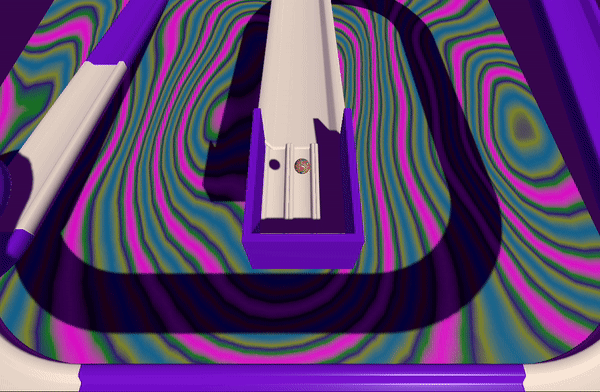

## Add a ball

In this step you will add a ball and place it at the top of your track so that it rolls down. 

### Add a sphere

--- task ---

Add a Sphere GameObject and rename it to `Ball`. 

Scale the ball to fit your project (we used  X=`0.25`, Y=`0.25`, Z=`0.25`).

Add a material for your ball.

[[[unity-transform-tools]]]
[[[unity-existing-material]]]
[[[unity-material-with-texture]]]
[[[unity-glass-material]]]

--- /task ---

--- task ---

Position the ball at the top of your track slightly higher than the track surface.

[[[unity-scene-navigation]]]
[[[unity-scene-top-down]]]
[[[unity-3D-coordinates]]]

**Tip**: The 'Top' view is a good view for making sure that your ball is in the right place.

--- /task ---

### React to gravity

--- task ---

Add a Rigidbody to your ball. 

[[[unity-rigidbody]]]

--- /task ---

--- task ---

Click on the **View tool** in the Scene view (the hand icon) and drag the view until you can see the ball and the track.

Align the camera to the Scene view.

[[[unity-align-with-view]]]

--- /task ---

--- task ---

**Test:** Play your scene and the ball should roll down your track. 

**Debug:** If your ball gets stuck then you may need to redesign your track.

--- /task ---

### Apply physics material

--- task ---

Create a bouncy material.

[[[bouncy-material]]]

--- /task ---

--- task ---

Click **Play** and watch your ball bounce as it lands on the ramp.

**Debug:** If your ball bounces too high and keeps bouncing off the track or if your ball moves too slowly you may need to adjust the values in your Physic Materials.

--- /task ---

### User interaction

--- task ---

**Choose** how you would like your camera to work.

You could keep the camera in a fixed position:

[[[unity-align-with-view]]]

Or, drag the Scene view so that you are behind the ball then follow the ball down the track: 

[[[unity-scene-navigation]]]
[[[unity-camera-follow-ball]]]

--- /task ---

--- task ---

**Test** your camera view by running your project. 

--- /task ---

--- task ---

**Choose** Your ball can roll down the track just using gravity or you can also use keys to control your ball.

[[[unity-control-ball]]]
[[[unity-keyboard-conventions]]]

--- /task ---

--- task ---

**Test** your ball controls by running your project. 

--- /task ---

