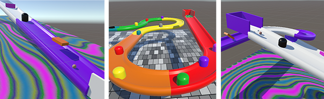

## Interactive objects

In this step, you will add fixed and spinning obstacles for the ball to bounce off.

### Add obstacles

--- task ---

**Add** obstacles to your track.

[[[unity-3D-coordinates]]]
[[[unity-transform-tools]]]
[[[unity-model-gameobject]]]
[[[unity-3d-objects]]]
[[[unity-scene-navigation]]]
[[[unity-scene-top-down]]]

--- /task ---

### Spin your obstacles

--- task ---

**Choose** which obstacles you would like to spin.

[[[unity-spin-script]]]

--- /task ---

--- task ---

**Test** your project. Adjust the spin directions and speeds until you are happy with the effects. 

--- /task ---

### Add materials

--- task ---

**Choose** materials for your obstacles.

[[[unity-existing-material]]]
[[[unity-material-with-texture]]]
[[[unity-glass-material]]]

--- /task ---

--- task ---

**Choose** add physic materials to your obstacles.

[[[bouncy-material]]]
[[[add-friction]]]

--- /task ---

--- task ---

**Test** your project. See if the physics materials that you have added, create the desired effect.

--- /task ---

