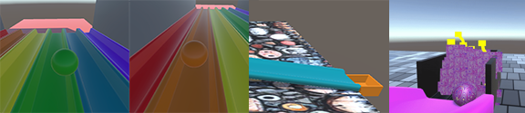
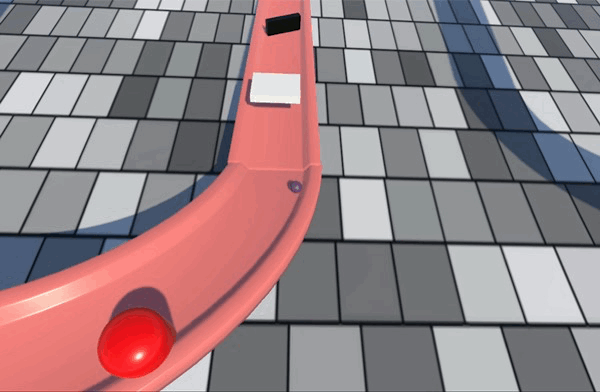

##  Track and goal effects

In this step, you will add effects to your track and your goal. 

### Add effects to your track

--- task ---

**Choose** which effects you would like to add to your track. You could:
+ Make the track change colour as the ball rolls over it
+ Make an obstacle change colour when the ball touches it
+ Make a sound play when an obstacle is hit by the ball

[[[unity-play-sound-collision]]]
[[[unity-change-material-when-collided]]]

--- /task ---

### Add effects to your goal

--- task ---

**Choose** which effects you would like to add to your goal. 

You could:
+ Make the goal change colour when the ball rolls into it
+ Make the ball change colour when it reaches the goal
+ Make a sound play when the ball reaches the goal
+ Trigger a particle effect when the ball reaches the goal

[[[unity-goal-material]]]
[[[unity-play-sound-collision]]]

--- collapse ---
---
title: Adding a fireworks particle effect
---

Navigate to the 'Fireworks' particle effect in **Assets > Particle systems**.

Drag the 'Fireworks' effect onto the 'Goal' in the Hierarchy window. 

The Fireworks will begin to animate.

To adjust their size and the speed, change the settings in the Inspector window.

You could:
+ Adjust the 'Start Speed', 'Start Size', and 'Max Particles'
+ Open the 'Shape' collapse and reduce the X value to make it smaller

Next, add a 'FinishEffects' script to the 'Goal'.

Enter the following code:

--- code ---
---
language: cs
filename: FinishEffects.cs
line_numbers: true
line_number_start: 1
line_highlights: 
---

using System.Collections;
using System.Collections.Generic;
using UnityEngine;

public class FinishEffects : MonoBehaviour
{
   ParticleSystem completeParticleSystem;

   void Start()
   {
       completeParticleSystem = GetComponentInChildren<ParticleSystem>();
   }

   void OnCollisionEnter(Collision other)
   {
       if (other.gameObject.tag == "Player")
       {
           completeParticleSystem.GetComponent<ParticleSystemRenderer>().material = other.gameObject.GetComponent<Renderer>().material;
           completeParticleSystem.Play();
       }
   }
}

--- /code ---

--- /collapse ---

[[[unity-ball-material]]]

--- /task ---

--- task ---

**Test** and **debug** your goal and track effects. 

--- collapse ---
---
title: The sound isn't playing when my ball reaches the goal
---

+ Check that you have added the `PlaySound` script to the `Goal` parent GameObject and not one of the parts within it
+ Check that your `Goal` GameObject has a 'BoxCollider'
+ Check that your `Goal` BoxCollider is wide enough to trigger an effect
+ Check that you have added an 'AudioSource' component to the `Goal` GameObject
+ Check that the 'AudioSource' component has a sound attached

--- /collapse ---

--- /task ---
