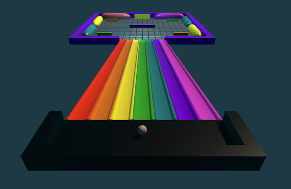

## What next?

If you are following the [More Unity](https://projects.raspberrypi.org/en/raspberrypi/more-unity) path, you can move on to the [Marble Mayhem!](https://projects.raspberrypi.org/en/projects/marble-mayhem) project. In this project, you will take everything you have learned in this path so far and put it together to create a rolling ball game or art piece all your very own.

--- no-print ---

Click on the embedded project and use the <kbd>WASD</kbd> keys to roll the ball down the ramp. Try to change the material of every floor tile by rolling around on it.

<iframe allowtransparency="true" width="710" height="500" src="https://raspberrypilearning.github.io/unity-webgl/MarbleMayhemRainbowBounce/" scrolling = "no" frameborder="0"></iframe>

--- /no-print ---

--- print-only ---

--- /print-only ---

If you want to have more fun exploring Unity, then you could try out any of [these projects](https://projects.raspberrypi.org/en/projects?software%5B%5D=unity).

If you want to create your own material to add to your marble you could try out the [Blender - Add material effects to a marble](https://projects.raspberrypi.org/en/projects/blender-marble) project.  
